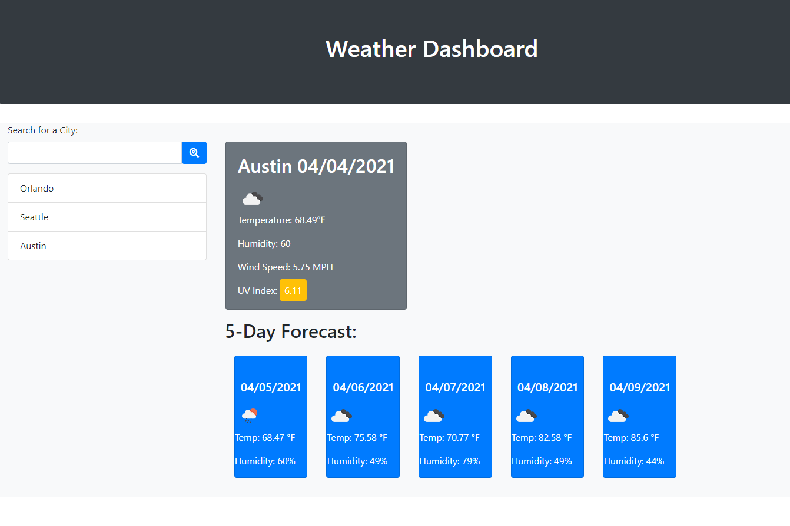

# Weather Dashboard

The goal of this project was to create a responsive single-page website that uses a 3rd-party weather API to dynamically render current weather data as well as a 5-day forecast on to the screen. The user is able to search for a city to display the weather, this search term is saved to local storage and added to the page in case they would like to check it again. The author utilized the Bootstrap library as well as Moment.js for dates and times.

## Functionality

This website functions through the use of Javascript queryselectors to get and set data to HTML elements on the page. We make use of the Open Weather Maps API in order to fetch two sets of data from their servers to provide us with all the data needed for current weather and a five day forecast.

## Challenges
Overall this project was completed without any major headaches. Prior assignments and in-class instruction provided the tools and practice needed to build this page in a timely manner. Navigating the JSON objects returned by the API did take some time to determine which data points were needed to populate the HTML elements. The displayCity function by its completion became quite large at ~100 lines given how many new elements were being generated and the need to assign them bootstrap classes for styling.

## Future Improvements
One possible change that could be made to future revisions of this website is in regards to the search history section. Currently the search history list updates everytime a city is accessed, even if that city has been show recently, resulting in the list showing the same city multiple times. A simple fix might involve changes to the saveSearch function to add a validation that the search term is not currently saved in local storage.
  

The website can be found live at the following link: 
### https://trev-eck.github.io/weather-dashboard/
